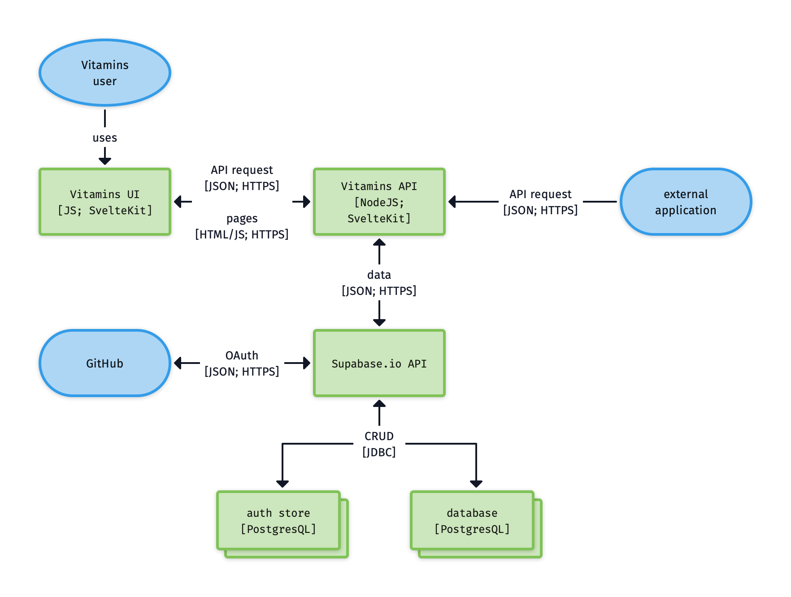
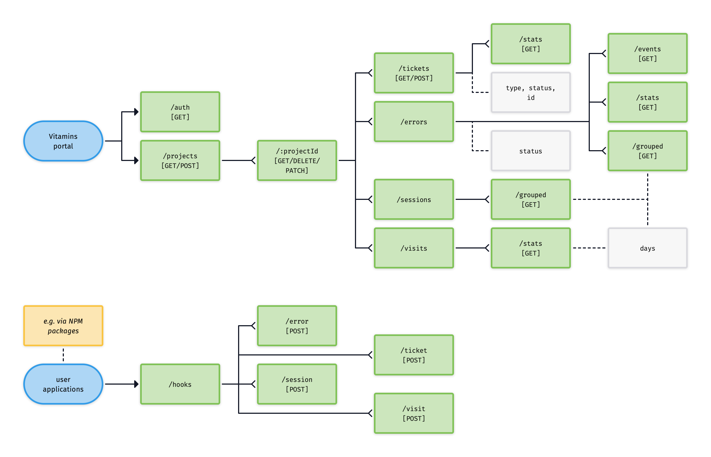

# Vitamins

**NOTE: Vitamins is still in development and cannot be used**

Vitamins is a service being created that provides DevOps tooling for small to medium applications, businesses and services. It allows you to:

- Analyze sessions & visits in your application
- Collect and manage feedback of users
- Analyze error and what happened

The current focus is the portal (incl. project management) and NPM packages that can faciliate the above in your JavaScript and TypeScript application.

> It is possible to send information from applications build on different technologies. However, no support is provided through package development at this point in time.

## Taxonomy & data model

- **Ticket**: a ticket is a piece of feedback invoked by users manually. This can be an idea for an improvement, reporting a bug, or something else entirely.
- **Session**: a session is a single visit to an application. It starts when you navigate to the application, and closes when you close the application. A session can consists of multiple pages visited.
- **Visit**: a visit to a page in the application.
- **Error**: an error is something that went wrong in the application
- **Event**: an event is something that happened in the application that is logged. A list of events that happen just before an error provide context of what happened in the system. Examples are page visits, fetch requests, handling of responses, reading files, etc.
- **Project**: all of the above are aggregated under a configured project of a user. A project can be an application, service, or a test version of an application even.

## Application architecture

The appliation is build using SvelteKit to create a server-side rendered application, hosted on Vercel's infrastructure. SvelteKit also provides the ability to expose additional APIs that can be used by applications of Vitamin's users to post data that becomes visible in the portal. The SvelteKit application uses Supabase.io as 'back-end-as-a-service' and 'database-as-a-service'. The Vitamins APIs talk with the Supabase APIs to either post data, or retrieve data from the underlying service. In addition, Supabase.io is also used for authentication, using the OAuth pattern with GitHub accounts.

## Information architecture portal

An information architecture (IA) is not part of the on-screen UI, it is not the same as the navigation. The goal if a navigation is to help a user find information. Navigation is, therefor, part of the UI design. It is not (always) visible in the UI, but heavily impacts the UX by informing the UI. IA has two main goals:

- Identification and definition of content and functionality
- Organization, structure and naming that defines the relationship between content/functionality.

## API architecture

Similar to the information architecture, the API architecture shows how the portal can interact with the underlying system, but also how other systems can interact (e.g. via the NPM packages) with the system.

